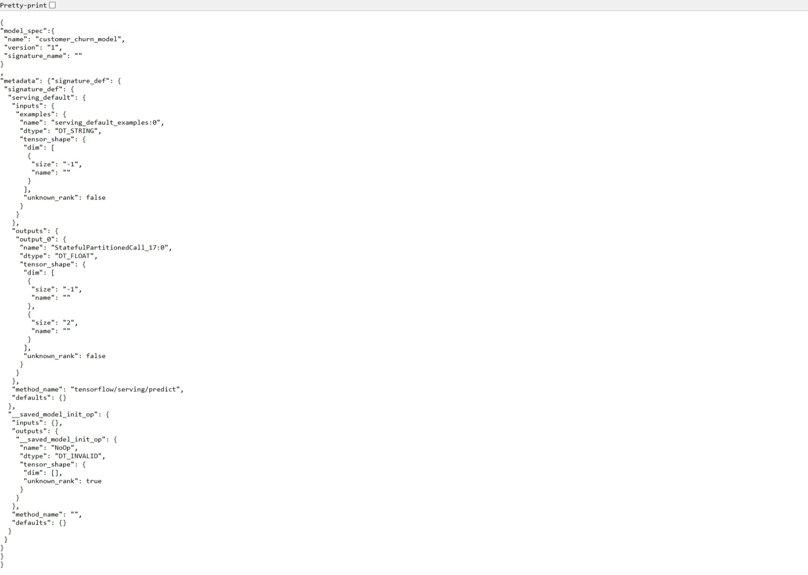

# Telco Customer Churn Prediction Pipeline (TFX)

Proyek ini merupakan implementasi _end-to-end Machine Learning Pipeline_ menggunakan **TensorFlow Extended (TFX)** untuk memprediksi risiko kehilangan pelanggan (_customer churn_) pada perusahaan telekomunikasi. Proyek ini disusun untuk memenuhi kriteria kelulusan dengan nilai maksimal (Bintang 5) pada kelas MLOps Dicoding.

## 👤 Informasi Pengembang

- **Nama:** Bayu Frassetyo Wibowo
- **Username Dicoding:** bayufrassetyo

## 📋 Dokumentasi Proyek (Format Resmi Dicoding)

| Komponen                    | Deskripsi                                                                                                                                                                                                                                                                                                                                                                                                                                                                                                                                                          |
| :-------------------------- | :----------------------------------------------------------------------------------------------------------------------------------------------------------------------------------------------------------------------------------------------------------------------------------------------------------------------------------------------------------------------------------------------------------------------------------------------------------------------------------------------------------------------------------------------------------------- |
| **Nama Proyek**             | Telco Customer Churn Prediction Pipeline using TFX                                                                                                                                                                                                                                                                                                                                                                                                                                                                                                                 |
| **Nama**                    | Bayu Frassetyo Wibowo                                                                                                                                                                                                                                                                                                                                                                                                                                                                                                                                              |
| **Username Dicoding**       | bayufrassetyo                                                                                                                                                                                                                                                                                                                                                                                                                                                                                                                                                      |
| **Dataset**                 | Telco Customer Churn Dataset (Kaggle)                                                                                                                                                                                                                                                                                                                                                                                                                                                                                                                              |
| **Masalah**                 | Tingginya angka kehilangan pelanggan (_customer churn_) di industri telekomunikasi berdampak langsung pada penurunan pendapatan perusahaan. Mengakuisisi pelanggan baru membutuhkan biaya yang jauh lebih mahal daripada mempertahankan pelanggan yang sudah ada. Oleh karena itu, perusahaan membutuhkan sistem otomatis yang mampu mendeteksi profil pelanggan yang berisiko tinggi untuk berhenti berlangganan.                                                                                                                                                 |
| **Solusi Machine Learning** | Membangun _machine learning pipeline_ terotomatisasi dari hulu ke hilir menggunakan TensorFlow Extended (TFX). Target utama proyek ini adalah menghasilkan model klasifikasi biner berbasis Deep Neural Network (DNN) yang stabil, tervalidasi secara otomatis melalui komponen _Evaluator_, serta siap dideploy menggunakan _TensorFlow Serving_ di dalam container Docker.                                                                                                                                                                                       |
| **Metode Pengolahan Data**  | Prapemrosesan data dilakukan secara terpusat pada komponen `Transform` menggunakan pustaka `tensorflow_transform` (TFT). Fitur numerik (`tenure`, `MonthlyCharges`, `TotalCharges`) dinormalisasi menggunakan teknik _Z-score scaling_ dan nilai kosong ditangani secara aman. Fitur kategorikal (seperti `gender`, `Contract`, `PaymentMethod`, dll.) dikonversi menjadi indeks representasi angka menggunakan teknik _vocabulary mapping_ agar siap dikonsumsi oleh model saraf tiruan.                                                                          |
| **Arsitektur Model**        | Model yang digunakan dibangun berbasis Deep Neural Network (DNN) menggunakan Keras Functional API. Arsitektur terdiri dari beberapa lapisan tersembunyi (_Dense Layers_) yang dikombinasikan dengan fungsi aktivasi _ReLU_, lapisan pengurang risiko _overfitting_ (_Dropout_), serta diakhiri dengan lapisan output beraktivasi _Softmax/Sigmoid_ untuk menghasilkan probabilitas prediksi biner. Proses pencarian hyperparameter (seperti _learning rate_ dan jumlah _units_) dijalankan secara otomatis via komponen _Tuner_ menggunakan algoritma _Hyperband_. |
| **Metrik Evaluasi**         | Metrik utama yang digunakan untuk mengevaluasi performa model adalah **BinaryAccuracy** (atau _CategoricalAccuracy_). Komponen _Evaluator_ dikonfigurasi secara ketat menggunakan _TensorFlow Model Analysis_ (TFMA) dengan menetapkan ambang batas batas minimal akurasi sebesar **0.90** dan memastikan performa model baru wajib lebih baik daripada model terdahulu sebelum dinyatakan layak edar (_blessed_).                                                                                                                                                 |
| **Performa Model**          | Performa model final diperoleh setelah proses _Hyperparameter Tuning_ otomatis selesai dieksekusi. Model yang dihasilkan berhasil melampaui ambang batas validasi yang ditetapkan oleh komponen _Evaluator_, memiliki tingkat akurasi yang tinggi, minim _overfitting_, serta berhasil diekspor secara otomatis oleh komponen _Pusher_ ke direktori penyajian model (_serving model directory_).                                                                                                                                                                   |

---

## 🛠️ Persiapan Lingkungan (Environment)

1. Pastikan Anda menggunakan Python 3.9.
2. Buat virtual environment dan pasang dependensi:
   ```bash
   python -m venv mlops-tfx
   mlops-tfx\Scripts\activate.bat
   pip install -r requirements.txt
   ```

---

## 📸 Bukti Model Serving dengan Docker

Berikut merupakan bukti tangkapan layar (_screenshot_) dari TensorFlow Serving yang berhasil dijalankan di dalam kontainer Docker lokal:


